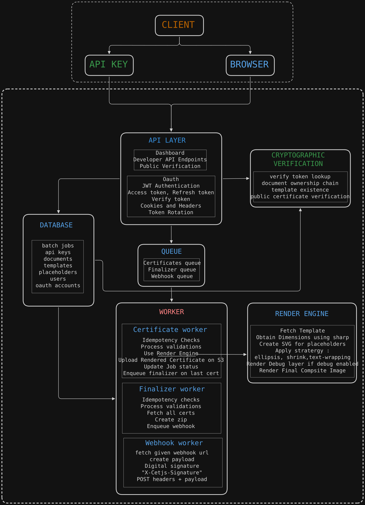

# CertJS

> Async certificate generation platform for developers.

CertJS allows developers, educators, event organizers, and communities to generate certificates at scale using reusable templates and a simple API.

Instead of manually designing and exporting certificates one by one, create a template once, define dynamic placeholders, and generate hundreds or thousands of certificates through a single API request.

---

## Architecture
<details open>
<summary><b>System Architecture</b></summary>

<p align="center">
  
</p>

</details>

---

## Features

### Template Management

* Upload certificate templates
* Create reusable certificate designs
* Visual placeholder positioning
* Dynamic text rendering
* Template versioning and management

### Batch Certificate Generation

* Generate certificates for hundreds or thousands of recipients
* Background job processing
* Automatic retry handling
* Progress tracking
* Download generated certificates as ZIP archives

### Developer API

* API key authentication
* Batch job creation
* Job status polling
* Document retrieval
* ZIP download endpoints

### Webhooks

* Receive notifications when jobs complete
* Signed webhook payloads
* Retry support
* Event-driven integrations

### Certificate Verification

* Public certificate verification endpoint
* Verification tokens
* Authenticity validation

### Storage

* Cloud storage for generated documents
* Secure download URLs
* Archive generation for batch jobs

---

## How It Works

1. Create a template in the dashboard.
2. Add placeholders such as:

```text
name
course
rank
college
score
```

3. Save the template.
4. Generate certificates by submitting recipient data through the API.
5. Track progress using polling or webhooks.
6. Download individual certificates or the generated ZIP archive.

---

## Example Use Cases

### Quiz Platforms

Generate certificates automatically after a competition or quiz event.

### Hackathons

Issue participation, finalist, and winner certificates at scale.

### Educational Platforms

Generate course completion certificates for students.

### Community Events

Distribute certificates for workshops, seminars, and conferences.

---

## Example Workflow

```text
Create Template
       ↓
Upload Recipients
       ↓
Create Batch Job
       ↓
Certificates Generated
       ↓
ZIP Archive Created
       ↓
Webhook / Polling Notification
       ↓
Download Certificates
```

---

## Technology Stack

### Backend

* Node.js
* Express.js
* TypeScript

### Database

* PostgreSQL
* Drizzle ORM

### Queueing & Processing

* Redis
* BullMQ

### Storage

* AWS S3

### Authentication

* JWT Authentication
* Google OAuth
* API Keys

## API Overview

### Create Job

```http
POST /api/v1/jobs
```

### Get Job Status

```http
GET /api/v1/jobs/:jobId
```

### Get Job Documents

```http
GET /api/v1/jobs/:jobId/documents
```

### Download ZIP

```http
GET /api/v1/jobs/:jobId/download
```

### Verify Certificate

```http
GET /verify/:verifyToken
```

Detailed API documentation is available in the `/docs` directory.

---

## Roadmap

### Planned

* Official JavaScript/TypeScript SDK
* Real-time progress updates
* WebSocket support
* Client libraries
* Template sharing
* Analytics dashboard

---

## Motivation

CertJS was created to solve a practical problem: generating certificates at scale without manually designing and exporting every document.

The goal is to provide a developer-friendly certificate infrastructure that can be integrated into educational platforms, event management systems, quiz applications, and community tools.

---

## License

MIT License